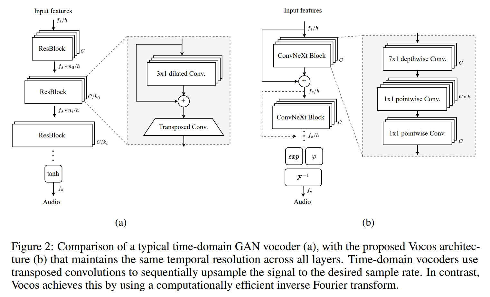

# Vocos PyTorch

  

PyTorch implementation of Vocos.

[Vocos](https://arxiv.org/abs/2306.00814): Closing the gap between time-domain and Fourier-based neural vocoders for high-quality audio synthesis.
